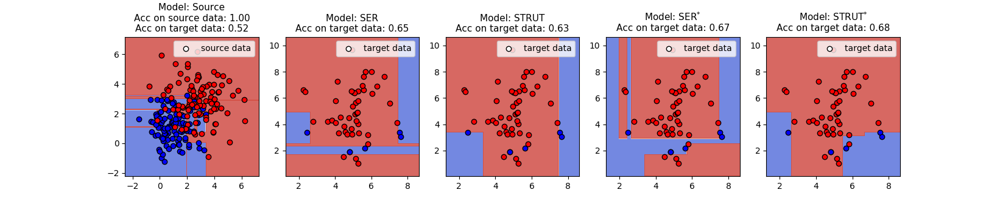

# Transfer algorithms on Decision Trees


## Introduction

SER and STRUT are two transfer learning algorithms applicable on decision trees (and therefore any tree ensemble such as a random forest) designed by Segev et al. [1].
To tackle the **class imbalance** problem, several variants are proposed. These adaptations are presented with results on various experiments in Minvielle et al. [2].  
This code includes Python implementations of the original algorithms [1] and their
class-imabalance adapted variants [2].

This code is still under development.

## References

[1] N. Segev, M. Harel, S. Mannor, K. Crammer, and R. El-Yaniv, “Learn on  source,  refine  on  target:  a  model  transfer  learning  framework  with random  forests,” *IEEE  transactions  on  pattern  analysis  and  machine intelligence*, vol. 39, no. 9, pp. 1811–1824, 2017.
[[link]](https://ieeexplore.ieee.org/document/7592407)  
[2] L. Minvielle, M. Atiq, S. Peignier and M. Mougeot, "Transfer Learning on Decision Tree with Class Imbalance", *2019 IEEE 31st International Conference on Tools with Artificial Intelligence (ICTAI)*, 2019, pp. 1003-1010.
[[link]](https://ieeexplore.ieee.org/document/8995296)

## Code

### Pre-requisites

The code is developed with Python 3.5 and Scikit-learn 0.21 versions.
It acts directly on the Scikit-learn Decision Tree class.

## Details

<!--### lib_tree.py-->

<!--Path: *Transfer_DT/*-->


<!--All sub-functions that manipulates decision trees structure, compute scores (error, gini, divergence...) used by the transfer algorithms.-->

### strut.py

path: *Transfer_DT/Class_Imb_Strut/*

STRUT and its variant versions. Each version corresponding to different Boolean parameters of the function.

versions : 

* STRUT
```python
strut.STRUT(DT_source, 0, X_target, y_target)
```

* STRUT without the divergence (classical information gain instead)
  (STRUT ND in [2], or STRUT<sub>IG</sub>)
```python
strut.STRUT(DT_source, 0, X_target, y_target, use_divergence=False)
```

* STRUT adapted to homogeneous imbalanced (STRUT<sup>\*</sup> in [2], or
  STRUT<sub>HI</sub>)
```python
strut.STRUT(DT_source, 0, X_target, y_target, X_target, y_target, adapt_prop=True, coeffs=[0.95,0.05])
```


### ser.py

path: *Transfer_DT/Class_Imb_Ser/*


SER and its variant versions. Each version corresponding to different Boolean parameters of the function.

versions : 

* SER
```python
ser.SER(0, DT_source, X_target, y_target, original_ser=True)
```

* SER without reduction (SER<sup>\*</sup> in [2])
```python
ser.SER(0, DT_source, X_target, y_target, original_ser=False, no_red_on_cl=True, cl_no_red=[1])
```

* SER without expansion
```python
ser.SER(0, DT_source, X_target, y_target, original_ser=False, no_ext_on_cl=True, cl_no_ext=[1])
```


* SER with leaf loss risk estimation (or SER<sub>LL</sub>)
```python
ser.SER(0, DT_source, X_target, y_target, original_ser=False, no_red_on_cl=True, cl_no_red=[1], leaf_loss_quantify=True, leaf_loss_threshold=0.5) 
```

## Basic example
path: *Transfer_DT/examples/*

Executing basic_example.py yields:



<!--## More advanced examples-->

<!--path: *Transfer_DT/examples/*-->

<!--example_ser.py and example_strut.py execute several variants over real data.-->
